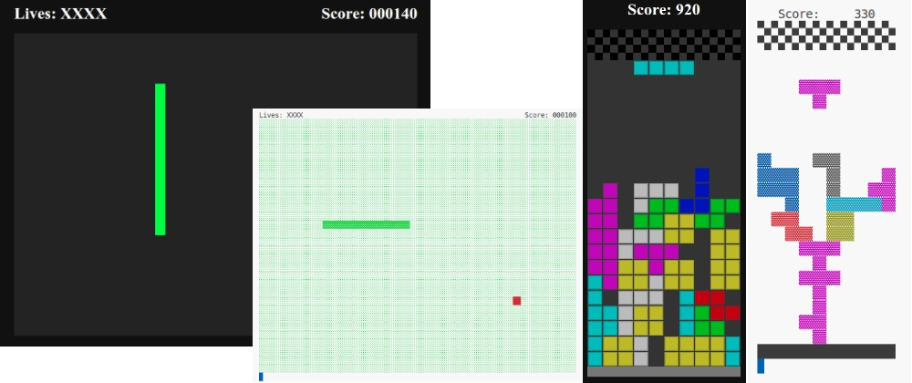
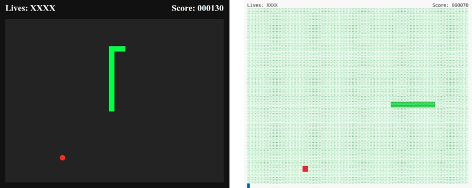
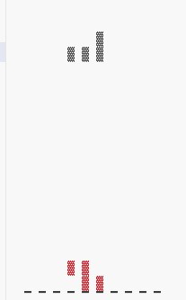
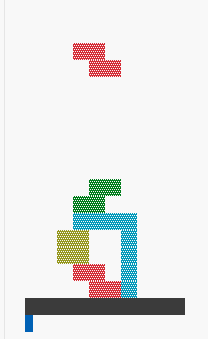
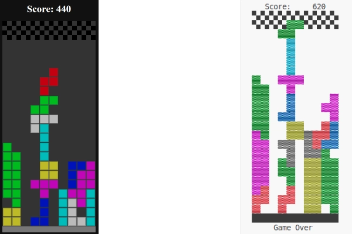

# Web games in a FP style

## Introduction

After having a link in my YouTube Watch Later list for some years I finally found time to watch ["Game Development with Functional Programming in JavaScript"](https://www.youtube.com/playlist?list=PLrhzvIcii6GOfRvsaVVdYSRjRhPWgAIKc) by [Dr Christopher Okhravi](https://www.uu.se/en/contact-and-organisation/staff?query=N12-1461). I am so glad I kept it all this time as the three-part series of 30-ish minute videos were well worth watching. The author has an excellent present style and has kindly provided the source code in [GitHub](https://github.com/chrokh/fp-games/tree/master). In fact, Dr Okhravi has also responded to a YouTuber's request and supplied an implementation of the Tetris game, but only for the terminal and all code is in a single file.

Despite being unchanged for more than 6 years (last commit Jan 2019) the code still works perfectly, which is a testament to both the author and the coding style he employed. I really liked the separation of the helper functions that are implemented using Functional Programming (FP) capabilities, idiomatic to JS. I also liked how the state model was partitioned in such a way it could be used to support both a web and terminal user interface, excellent architecture.

However, there were a few things I thought I could, not improve on, but modernise. The first issue was the approach that was taken to modularise the code, which was reasonable then, but now we have ES6 modules widely supported in Node JS (version 24) and browsers (Chrome 136, Linux). The second issue was the use of constants which can (IMO) be better dealt with via a JSON file, more on this later. Finally, the terminal only, all in one file, Tetris game was far too tempting a challenge. More on this in part 2.

## Part One: [Snake game](<https://en.wikipedia.org/wiki/Snake_(video_game_genre)>)

Out of the two, I knew this would be the easier game to work on as so much was already there. The game is quite simple so the lack of unit tests to inform me when I broke something was not too much of an issue.

### Modules

Dr Okhravi had included some patch code to the web version so the additional files could be loaded in the terminal (via Node JS) using the CommonJS approach yet also be usable in the browser. With ESM we can harmonise these and use JS modules in both places, which was not possible before and only relatively recently been a practicable proposal.

### Constants

"It's not you, it's (most definitely) me". When I see a bunch of constant values, and worst magic values, I get the urge to relocate then into their own file. I go one step further when the values are primitives (JSON-able), and I format the data as [JSON](https://www.json.org/json-en.html) and import using the new ['with' syntax](https://developer.mozilla.org/en-US/docs/Web/JavaScript/Reference/Statements/import/with), supported by most browsers. If all-inclusive browser support is required then the Fetch API (or an XHR library such as [axios](https://axios-http.com/)) can be used to load and parse the JSON string. My rationale for this approach is two fold. One, I like to have all my constants in one place, which I accept could be considered irrational. The other reason is the knowledge, which might not longer be true, that processing JSON is faster than processing native JS objects because of the more predictable syntax.

### Switches

Another, irrational hang-up of mine is my hatred of the switch statement. I cannot help but think it is clumsy and inelegant syntax, whatever the language. It is so often used as a verbose version of pattern matching and, at least in my mind, we can usually do better using a mapping object.

### Final weeks

Every time I played the game I could not help but ask myself, why is the apple not round. Although the syntax is a little more complicated, the ellipse command can be used easily, so I did. There was/is an inconsistency in the use of the right-hand letter keys to control the direction of the snake. The terminal version (cli.js) uses hjkl for left, down, up, right, respectively. The web version uses the keys as follows: up, left, down, right. When I saw this my eye started to twitch. I decided to standardise the keys to use the CLI (Command-Line Interface) directions as they seemed most logical to me. What do I know, I don't play computer games much as I have too much fun coding.

## Part Two: [Tetris](https://en.wikipedia.org/wiki/Tetris) game

As stated above, the Tetris game only rendered to the terminal (CLI) and was contained all in a single file. All the code to manage and render the current state of the game, the code to detect the user controls (key presses) and update the state through matrix manipulation etc. all in little more than 200 lines of code.

I cannot recall the exact steps and think they might not be that entertaining if I could. But, should you want to replicate my actions you might find them educational. However, in the process of migrating the code and transforming it into a web GUI (Graphical User Interface) I fear I have lost the original intention of Dr Okhravi' FP teach, sorry.

### Redistributing the files

1. Rename `main.js` to `cli.js` to reflect the intended purpose.
2. Extract the top 30 lines of utility functions into its own JS module called `general.js` and arrange them alphabetically. However, the `pipe` function needs to be declared at the top because it is a dependency for other functions.
3. In the `cli.js` file, we move the CJS (Common JS) version of the `readline` package import from line 149 to the top an convert it into an ESM import. Also, prefix the `cli.js` file with a `shebang` for node `#!/usr/bin/env node`.
4. Like with the snake game, I will create a constants file in JSON format and move the pieces variable from the `cli` file. The variable will also be renames to all uppercase to reflect its immutable nature.
5. The constants file will be imported into the cli file as the CONSTANTS variable. `import CONSTANTS from './constants.json' with { type: 'json' };` so the `pieces` variable should replaced by `CONSTANTS.PIECES`.
6. We will refine the structures as follows:

- Extend the letter O from being a 2x2 mapping to a 4x4 by surrounding the digits with zeros.
- The letters I, T, S and L will be rotated 180 degrees to enable the top row to be all zeros. The letters J and Z can remain unchanged.
- This constant will be extended later to include the value of each piece when we introduce scoring.

7. In preparation for further development we will create the `tetris.js` file to manage the game and expose the following methods:

- **initialState**: prepares the starting condition of the game.
- **enqueue**: process moves instigated by the player.
- **next**: periodic update of state.
  Into the game file we will also import functions from the `general.js` as well as values from the `constants.json` file.

8. Again, like the snake game we will create a `matrix.js` file to contain functions specifically for matrix manipulation and import the constants and utility functions. This file will be imported into the `tetris.js` file.

At this point we have all the files we need for the CLI version and the `general.js` is complete. However, there is a great deal more to be done with the `cli.js` file to extract more constants, generic game logic and the supporting matrix functions. There is a logical grouping within the CLI file content:

- **Game loop** - to refresh the presentation.
- **Key(board) events** - to accept and process the user input.
- **Main Timer** - although this is slightly hidden at the bottom of the file.
- **Functions and constants namespaces**
  - _Color_: An object containing a collection of functions (methods) using an ANSI escape sequence to change the colour of text output.
  - _Piece_: A function to convert the numerical representation of a Piece (as stored in the PIECES structure) into the required ANSI escape sequence.
  - _Matrix_: A collection of functions for manipulation of matrices (homogeneous arrays of arrays).
  - _Random_: Only has the `pick` method to select and entry from an array. It is only used once for selecting a Piece at random.
  - _Player_: Controls selecting a new piece, advancing it down the screen and applying any rotation the user instructs.
  - _State_: The main game state model, controlling the main game play
  - _Board_: Combines the play area, the previously amassed pieces and the piece currently in play.

Without unit tests to provide a safety net for refactoring, it is important to exercise the game frequently to ensure it remains in tact. However, the above changes have resulted in a broken system that can be restored by temporarily importing the general functions.

In its current (and original) form there is a gap between each of the character graphics, which is somewhat ugly IMO.

A few minor tweaks can improve this considerably.

1. Replace the '▔' character in the `Matrix.frame` function, for '██'.
2. Remove the space from the join method used in the `Matrix.toStr` function.
3. Create constants for the base characters and the empty space.
4. In the `cli.js` file, the `Piece.toStr` needs revising to return double characters.

### Further extraction

1. We have a `matrix.js` file but at the moment it is largely empty and redundant. Let's address that by moving the Matrix object from the `cli.js` file and importing as the default object. Once relocated we will reconstruct the Matrix object in a more conventional way, replace some constants and retest.
2. Next we will extricate the Color, Piece and Random objects creating constants and functions to replace them.

- **Random** will be replace with a simple `pick` function and relocated to the `Matrix` module.
- **Color** can be replaced with a single mapping function and an object mapping colour names to the ANSI escape codes (CHAR_COLOURS) in the constants object.

## 
