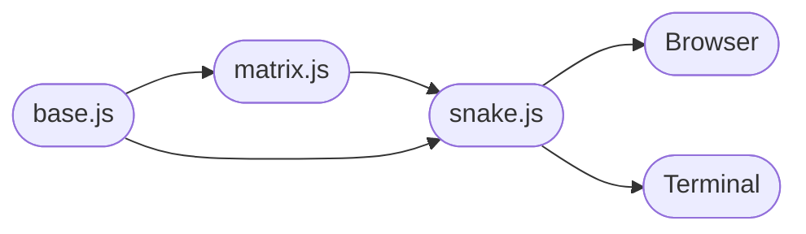

# Snake

The game Snake implemented with functional style in JavaScript without libraries. Interfaces for browsers and terminals.

## Rules

- Use arrow keys, wasd, or hjkl to control the snake.
- Collect apples and avoid crashing into yourself.
- Press Escape to quit (in terminal).

## Files

