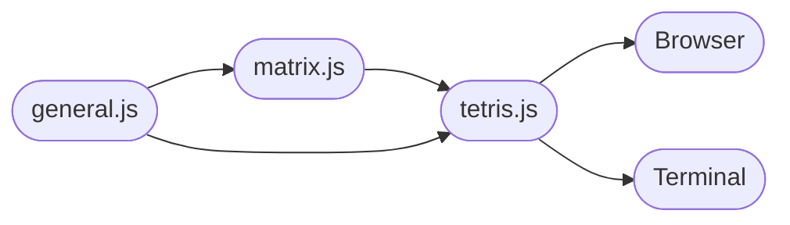

# Tetris

The game Tetris implemented with functional style in JavaScript without libraries.

## Rules

- Use arrow keys, wasd, or hjkl to control the pieces.
- Make as many complete rows (no gaps) as you can and avoid filling the frame.
- Press Escape to quit (in terminal).

## Files

